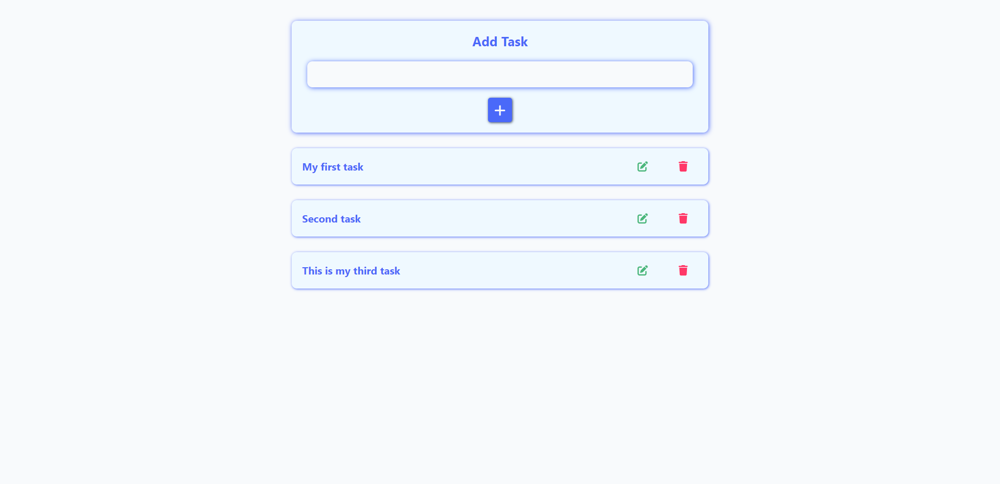

# BriskTask - Fullstack Todo App

Responsive Todo app created with React, Node and MySQL.

Frontend is deployed on Netlify: https://brisktask.netlify.app

## Built with

-   HTML
-   CSS
-   JavaScript
-   React
-   Node
-   MySQL

## Installation and Setup

-   You can clone this repository if you would like to check out app functionalities.

### DATABASE SETUP

-   On your local MySQL server create new database.
-   Navigate to `/backend/config/tables` where you will find SQL commands to recreate the tables needed.
-   Add those tables to the new databse you just created.

### .env SETUP

-   In the root folder create .env file with the following options:

    -   `DATABASE_PORT` = Port number that your MySQL server is running on
    -   `DATABASE_HOST` = Your MySQL host, default is `127.0.0.1`
    -   `DATABASE_USER` = Your MySQL user name, default is `root`
    -   `DATABASE_PASSWORD` = Password for your local MySQL access
    -   `DATABASE_NAME` = Name of the database you created during setup above
    -   `SERVER_HOSTNAME` = You can put the default `http://localhost` for the server hostname
    -   `SERVER_PORT` = Port number to run your local server on
    -   `JWT_SECRET` = JSON Web Token secret key, can be any string
    -   `JWT_TOKEN_EXPIRES` = Set token expiration time, for example `1h` means that token expires in 1 hour

### FRONTEND AND BACKEND SETUP

-   Navigate to the root folder and run: `npm install` and then `npm run dev` to start the Node server.
-   Navigate to the `/frontend` folder and run: `npm install` and then `npm run dev` to run React.

-   React frontend was created using Vite: https://vitejs.dev. Vite uses port `5173` by default.
-   To view the app, go to http://localhost:5173 in the browser.

## Description and Usage

-   You can perform authentication actions via login or registration form.
-   When you are logged in you can perform CRUD operations on your tasks.
-   While viewing your tasks, clicking on a pencil icon navigates to the update task page.
-   Clicking a trash can icon deletes a task from the database.
-   In the navbar, clicking the user icon shows a dropdown menu with the following options: profile and logout.
-   Clicking on profile will take you to the profile page.
-   This page displays user info and allows you to edit your name, email, change your password and delete your account.

## MySQL Tables

### USERS

| COLUMNS    | DESCRIPTION                                      |
| :--------- | :----------------------------------------------- |
| id         | INT NOT NULL PRIMARY KEY AUTO_INCREMENT          |
| name       | VARCHAR(255) NOT NULL                            |
| email      | VARCHAR(255) NOT NULL UNIQUE                     |
| password   | VARCHAR(255) NOT NULL                            |
| role       | VARCHAR(255) NOT NULL DEFAULT 'user'             |
| created_at | TIMESTAMP NOT NULL DEFAULT NOW()                 |
| updated_at | TIMESTAMP NOT NULL DEFAULT NOW() ON UPDATE NOW() |

### TASKS

| COLUMNS                  | DESCRIPTION                                      |
| :----------------------- | :----------------------------------------------- |
| id                       | INT NOT NULL PRIMARY KEY AUTO_INCREMENT          |
| name                     | VARCHAR(255) NOT NULL                            |
| user_id                  | INT NOT NULL                                     |
| user_email               | VARCHAR(255) NOT NULL                            |
| created_at               | TIMESTAMP NOT NULL DEFAULT NOW()                 |
| updated_at               | TIMESTAMP NOT NULL DEFAULT NOW() ON UPDATE NOW() |
| FOREIGN KEY (user_id)    | REFERENCES users(id) ON DELETE CASCADE           |
| FOREIGN KEY (user_email) | REFERENCES users(email) ON DELETE CASCADE        |

## License

MIT License. See `LICENSE.txt` for more information.

Background image used:
https://pixabay.com/illustrations/notes-pen-desk-flat-coffee-task-6399119/
