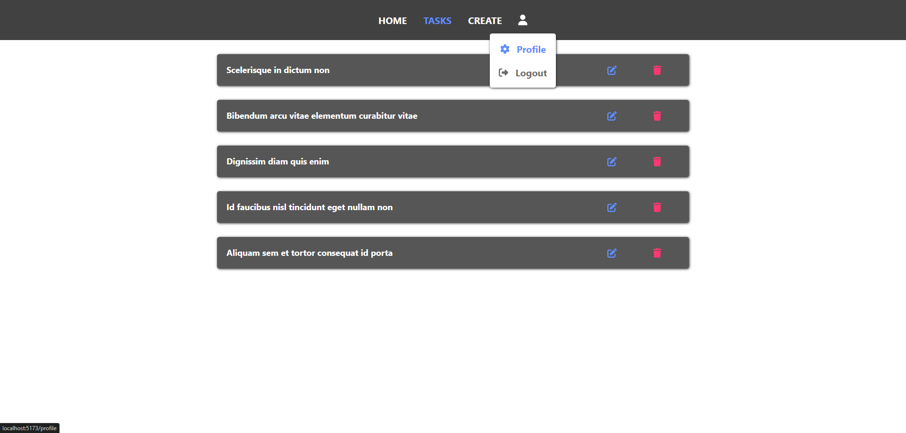

# BriskTask - Fullstack Todo App

Responsive Todo app created with React, Node and MySQL.

App is deployed on Render: https://brisktask-fullstack.onrender.com

If the app is inactive for 15 minutes, Render will spin it down which can cause around 30 seconds delay for the next request-response, so keep that in mind when you try to run the app after being inactive.

### Built with

-   HTML
-   CSS
-   JavaScript
-   React
-   Node
-   MySQL

## Installation and Setup

-   You can clone this repository if you would like to check out app functionalities.
-   To be able to run this on a localhost you need to navigate to the `controllers` folder inside the `frontend` folder.
-   In there you will find the controllers and they all run a `fetch()` function to the backend.
-   In front of the `/api/v1...` add something like `http://localhost:PORT_NUMBER` for every fetch for all of the controllers.
-   Example: `http://localhost:5174/api/v1/users...`

### DATABASE SETUP

-   On your local MySQL server, create a new database and add the following tables

USERS

```
    CREATE TABLE users(
        id INT NOT NULL PRIMARY KEY AUTO_INCREMENT,
        name VARCHAR(255) NOT NULL,
        email VARCHAR(255) NOT NULL UNIQUE,
        password VARCHAR(255) NOT NULL,
        role VARCHAR(255) NOT NULL DEFAULT 'user',
        created_at TIMESTAMP NOT NULL DEFAULT NOW(),
        updated_at TIMESTAMP NOT NULL DEFAULT NOW() ON UPDATE NOW()
    );
```

TASKS

```
CREATE TABLE tasks(
    id INT NOT NULL PRIMARY KEY AUTO_INCREMENT,
    name VARCHAR(255) NOT NULL,
    user_id INT NOT NULL,
    created_at TIMESTAMP NOT NULL DEFAULT NOW(),
    updated_at TIMESTAMP NOT NULL DEFAULT NOW() ON UPDATE NOW(),
    FOREIGN KEY (user_id) REFERENCES users(id) ON DELETE CASCADE,
);
```

### .env SETUP

-   Create new `.env` file in the root folder. Example of the environment variables needed:

```
    DATABASE_PORT = 3306 (or some other port your MySQL is running on)
    DATABASE_HOST = 127.0.0.1
    DATABASE_USER = yourUsername (default is root)
    DATABASE_PASSWORD = yourDatabasePassword
    DATABASE_NAME = databaseNameYouCreatedAbove
    JWT_SECRET = canBeAnyString
    JWT_TOKEN_EXPIRES = 1h (means that token expires in 1 hour, put something else if you want to)
```

### FRONTEND AND BACKEND SETUP

-   Navigate to the `root` folder, install packages and start the Node server

```
    npm install
    npm run dev
```

-   Navigate to the `/frontend` folder, install packages and run React

```
    npm install
    npm run dev
```

-   React frontend was created using Vite: https://vitejs.dev. Vite uses port `5173` by default.
-   To view the app, go to http://localhost:5173 in the browser.

## Description and Usage

-   You can perform authentication actions via login or registration form.
-   `IMPORTANT`: You don't have to use your real email since this app doesn't perform email verification.
    -   Just make sure email is in the valid format
    -   Examples: `apptesting@gmail.com`, `somerandomuser@yahoo.com` etc
    -   Keep in mind that email must be unique and there can't be duplicate users registered with the same email
-   When you are logged in you can perform CRUD operations on your tasks.
-   While viewing your tasks, clicking on a pencil icon navigates to the update task page.
-   Clicking a trash can icon deletes a task from the database.
-   In the navbar, clicking the user icon shows a dropdown menu with the following options: profile and logout.
-   Clicking on profile will take you to the profile page.
-   This page displays user info and allows you to edit your name, email, change your password and delete your account.

## License

MIT License. See `LICENSE.txt` for more information.
